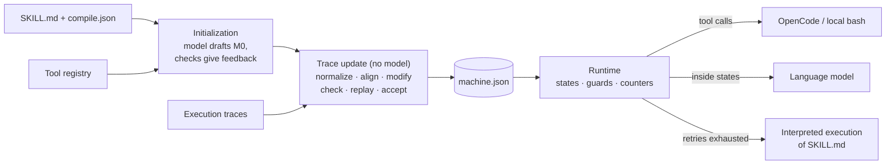

<div align="center">

# skill2fsm

**Compile agent skills into extended finite state machines.**

[](#installation)
[](#license)
[](CHANGELOG.md)

[Why](#why-skill2fsm) · [Installation](#installation) · [Quick start](#quick-start) · [Concepts](#concepts) ·
[CLI](#command-line-interface) · [Evaluation](#evaluation) · [Development](#development) · [Citation](#citation)

</div>

---

## Why skill2fsm

An agent skill (a `SKILL.md` document) tells an agent how to carry out a class of tasks. In the usual way of
executing a skill, the document sits in the model's context and the model chooses every next step, so
requirements that the document states clearly can still be skipped, reordered or applied in the wrong
situation.

skill2fsm compiles the skill into an **extended finite state machine**. The machine records progress in a
current state and a set of variables, executes the operation assigned to the current state and evaluates
transition guards over the recorded values to decide what comes next. Language models do the reasoning and
generation inside states, with the state's prompt and the variables it reads; the order of operations is
enforced by the program.

This package accompanies the paper *Compiling Agent Skills into Extended Finite State Machines*.

## Highlights

- **Readable, executable machines.** Plain JSON (`efsm-v1`) with typed variables, `tool` / `model` /
  `judge` / `user` / `end` actions, ordered guarded transitions, bounded loops and a fallback state.
- **Compilation from documents and traces.** A model drafts the initial machine from the skill document
  and redrafts it under check feedback; each trace then updates the machine without model calls through
  normalization, alignment, candidate construction, static checks and replay of every accepted trace.
- **Stepwise mode.** Incorporate traces step by step with decisions supplied by an external judge.
- **Graceful degradation.** The fallback state retries from the most recent tool step and then hands the
  task to interpreted execution of the skill, so a partially learned machine can still finish a task.
- **Real tool backends.** OpenCode's native tools, a local `bash` backend, or tools that the model realizes
  from registry definitions.
- **Evaluation harness.** Parallel comparison of machines with direct skill execution and memory baselines
  (Agent Workflow Memory, ReasoningBank); graders for spreadsheet, multiple-choice and file-answer tasks;
  paired exact tests.
- **Hermetic test suite.** More than 300 tests that need no network access, model endpoint or API key.

## How it works



1. **Initialization.** The model reads the skill document, its clauses, the tool definitions, the task
   input fields and the skill rules, and drafts a machine. Static checks (format, schema, guards,
   reachability and termination, clause coverage, tools) return errors to the model until a draft passes.
2. **Trace update.** Each trace is normalized into events, aligned with the machine, and turned into a
   candidate machine by reusing or adding states and transitions. The candidate is accepted only if it
   passes the variable, evidence, requirement and structure checks and replays the new trace and every
   previously accepted trace.
3. **Execution.** The runtime executes the action of the current state, writes the declared variables and
   takes the first transition whose guard holds. Models are called only for `model` and `judge` states.

## Installation

```bash
pip install .            # from a checkout; Python >= 3.11
pip install ".[all]"     # with every optional extra
```

| Extra | Adds | Needed for |
|---|---|---|
| `xlsx` | openpyxl | grading spreadsheet tasks |
| `memory` | numpy, sentence-transformers | `skill2fsm memory index / precompute / retrieve` |
| `dev` | pytest, build, twine | tests and packaging |

Running machines on real tasks also requires:

| Requirement | Used for |
|---|---|
| An OpenAI-compatible chat endpoint | model calls (see [Configuration](#configuration)) |
| [OpenCode](https://opencode.ai) on `PATH` | native tool execution and the skill-execution baseline (`--executor local` runs `bash` without it) |
| LibreOffice (`soffice`) | recalculating spreadsheets before grading |

## Quick start

The package ships a small hermetic example skill, `table_clean`, with scripted tools and a scripted model,
so a machine runs without network access:

```python
from skill2fsm import runtime
from skill2fsm.examples import table_clean as tc

machine = tc.reference_machine()
task = tc.gen_tasks(1, seed=0)[0]
result = runtime.run_task(
    machine, task,
    model=tc.build_model(),
    tools=tc.build_registry(tc.MemFS(task["files"])),
    doc=tc.skill_doc(),
)
print(result.stopped, " -> ".join(result.path()), tc.verify(task, result.trace))
# terminal s1 -> s2 -> s4 -> end True
```

With a real skill, the pipeline is: collect traces, compile, run.

```bash
# 1. Execute the skill with OpenCode; event streams are folded into traces
skill2fsm collect --tasks-file tasks.yaml --skill path/to/skill --out traces/ --model qwen3.6-flash

# 2. Initialize a machine from SKILL.md with the model, then update it over the traces (no model)
skill2fsm compile --skill path/to/skill --traces traces/ --out build/

# 3. Execute the machine on a task
skill2fsm run --machine build/machine.json --skill path/to/skill \
    --workbook input.xlsx --prompt "..." --golden golden.xlsx --answer-position B2:B17
```

## Concepts

### Machines

A machine is a JSON document in the `efsm-v1` format (`skill2fsm.schema.Machine`):

```json
{
  "format": "efsm-v1",
  "skill_id": "answer-file",
  "initial": "draft",
  "fallback": "FALLBACK",
  "variables": [
    {"name": "request", "init_from": "task.input.request"},
    {"name": "output_path", "init_from": "task.input.output_path"},
    {"name": "write_count", "type": "integer", "init": 0}
  ],
  "states": {
    "draft": {"id": "draft",
              "action": {"kind": "model", "reads": ["request", "output_path"], "writes": ["command"],
                         "prompt": "Solve the request. Write command: one shell command that writes only the final answer to output_path."},
              "transitions": [{"if": "write_count >= 2", "to": "FALLBACK"}, {"if": "", "to": "write"}]},
    "write": {"id": "write",
              "action": {"kind": "tool", "name": "bash", "input": {"command": "${command}"},
                         "writes": ["returncode", "stdout", "stderr"], "phase": "apply"},
              "transitions": [{"if": "returncode == 0", "to": "check"},
                              {"if": "", "to": "draft", "inc": "write_count"}]},
    "check": {"id": "check",
              "action": {"kind": "tool", "name": "read", "input": {"filePath": "${output_path}"},
                         "writes": ["ok", "stdout"], "phase": "verify"},
              "transitions": [{"if": "ok", "to": "END_VERIFIED"}, {"if": "", "to": "END_UNVERIFIED"}]},
    "END_VERIFIED": {"id": "END_VERIFIED", "action": {"kind": "end", "terminal": "END_VERIFIED"}},
    "END_UNVERIFIED": {"id": "END_UNVERIFIED", "action": {"kind": "end", "terminal": "END_UNVERIFIED"}},
    "FALLBACK": {"id": "FALLBACK", "action": {"kind": "end", "terminal": "END_FALLBACK"}}
  },
  "terminals": [
    {"id": "END_VERIFIED", "kind": "verified"},
    {"id": "END_UNVERIFIED", "kind": "unverified"},
    {"id": "END_FALLBACK", "kind": "fallback"}
  ]
}
```

| Element | Meaning |
|---|---|
| `variables` | Initialized from task inputs (`init_from`) or constants (`init`) and written by actions |
| `tool` action | Runs a named tool; `${var}` in the argument template is substituted at run time; outputs are written to `writes` |
| `model` action | Generates the listed variables from the state's prompt and the variables it reads |
| `judge` action | Chooses one label from a fixed set, or abstains |
| `user` / `end` action | Asks for input / finishes with a terminal |
| `transitions` | Evaluated in order after the action; the first guard that holds is taken; an empty guard is unconditional and comes last; `inc` increments a loop counter |
| `fallback` | Retries from the most recent tool step, then hands the task to interpreted execution of the skill |

Guards use a small whitelisted expression language (`skill2fsm.cond`) that supports static checks of
mutual exclusion and loop bounds; it never calls `eval`.

### Traces

Traces are JSON Lines files: a header with the task and its verdict, then one line per step.

```json
{"task_id": "t1", "arm": "agent", "harness": "opencode", "model": "qwen3.6-flash", "verdict": "accepted", "input": {"request": "...", "input_path": "", "output_path": "answer.txt"}}
{"kind": "tool", "name": "bash", "args": {"command": "python3 solve.py > answer.txt"}, "stdout": "", "stderr": "", "returncode": 0}
{"kind": "model", "text": "The answer has been written to answer.txt."}
{"kind": "end"}
```

`skill2fsm collect` and `skill2fsm fold-traces` produce this format from OpenCode event streams.

### Skill rules

A `compile.json` next to `SKILL.md` declares terminals, derived labels, requirements and terminal
conditions. Every rule quotes the sentence of the skill document it comes from. Without the file, the
compiler asks the model to extract the rules and checks each quote against the document.

```json
{
  "terminals": [{"id": "END_VERIFIED", "kind": "verified"}, {"id": "END_UNVERIFIED", "kind": "unverified"}],
  "labels": [
    {"label": "verify",
     "when": {"kind": "tool", "label": "probe", "args_contain": "${output_path}", "after": {"label": "apply"}},
     "quote": "Read the output file back after writing it."}
  ],
  "requirements": [
    {"id": "R1", "kind": "before", "a": {"kind": "tool", "label": "probe"}, "b": {"kind": "tool", "label": "apply"},
     "quote": "Inspect the input before changing anything."}
  ],
  "terminal_conditions": [
    {"terminal": "END_VERIFIED",
     "required_evidence": [{"kind": "tool", "label": "verify", "success": true}],
     "invalidating_events": [{"kind": "tool", "label": "apply"}],
     "quote": "Read the output file back after writing it."}
  ]
}
```

### Tools

Tool definitions come from a registry (`skill2fsm/backends/opencode.json` describes OpenCode's native
tools) or are inferred from traces. The compiler treats tool names as opaque identifiers. At run time a
machine may only use tools that the backend provides, or tools defined in a `--tools` registry, which the
model then realizes as shell commands; tools are never silently substituted.

## Command-line interface

| Command | Purpose |
|---|---|
| `skill2fsm compile` | Initialize a machine from a skill document (model) and update it over traces (no model) |
| `skill2fsm compile-stepwise` | Update a machine trace by trace with step decisions supplied by a judge |
| `skill2fsm run` | Execute a machine on one task (`xlsx`, `livemath` or `filetask` mode) |
| `skill2fsm collect` | Execute a skill with OpenCode on spreadsheet tasks and save traces |
| `skill2fsm fold-traces` | Turn the skill-arm event streams of a benchmark run into traces |
| `skill2fsm bench` | Run machine and skill-execution arms on a task set in parallel |
| `skill2fsm memory` | Build Agent Workflow Memory workflows and ReasoningBank memories |
| `skill2fsm summarize` | Compare arms on shared tasks: pass rate, time, tokens, paired exact tests |

Run `skill2fsm <command> --help` for all options; `python -m skill2fsm` is equivalent to `skill2fsm`.

### Configuration

| Setting | Effect |
|---|---|
| `MODEL`, `BASE_URL`, `API_KEY` | Endpoint used by `--provider default` (the default) |
| `MINIMAX_API_KEY`, `MINIMAX_MODEL`, `MINIMAX_BASE_URL` | Endpoint used by `--provider minimax` |
| `DEEPSEEK_API_KEY`, `DEEPSEEK_MODEL`, `DEEPSEEK_BASE_URL` | Endpoint used by `--provider deepseek` |
| `.env` | Read from the working directory upward; variables already set in the environment take precedence |
| `LABEL=self` | Memory baselines label trajectories by model self-judgement instead of the grader |
| `--no-think`, `--think-budget`, `--judge-think-budget` | Reasoning controls for Qwen-compatible endpoints |

See `.env.example` for a template.

## Evaluation

`skill2fsm bench` runs arms on a task set: `fsm` (a compiled machine), `skill` (OpenCode with the skill in
the system prompt), and `awm` / `rbank` (the skill arm with Agent Workflow Memory workflows or ReasoningBank
memories placed before the prompt). Task files are YAML lists:

```yaml
- id: t1
  turns: ["Compute the mean of column x in data.csv. Write @mean[value] to answer.txt."]
  metadata:
    verifier: dabench            # file-answer graders: dabench, sealqa_judge
    answers: [[mean, "34.65"]]
    assets: [data/data.csv]      # copied into the job directory; relative to --data-root
```

| Mode | Required metadata | Grading |
|---|---|---|
| `xlsx` | `init_asset`, `golden`, `answer_position` | SpreadsheetBench comparison after LibreOffice recalculation |
| `livemath` | `answer` | last `\boxed{X}` in `answer.txt` |
| `filetask` | `verifier`, `answers` or `answer`, `assets` or `assets_dir` + `assets_target` | `dabench`: `@name[value]` with the reference precision; `sealqa_judge`: recorded for an external judge |

```bash
skill2fsm bench --mode filetask --tasks-file tasks.yaml --tasks t1,t2 --reps 1 \
    --arms fsm,skill --machine build/machine.json --skill path/to/skill --out runs/test

# memory baselines built from a development run and frozen for the test run
skill2fsm memory convert runs/dev dev_traj.jsonl
skill2fsm memory awm dev_traj.jsonl workflows.txt
skill2fsm memory rbank dev_traj.jsonl bank.jsonl
skill2fsm memory index bank.jsonl
skill2fsm memory precompute bank.jsonl tasks.yaml test_ids.txt rbank.json --mode filetask
skill2fsm bench --mode filetask --tasks-file tasks.yaml --tasks t1,t2 --reps 1 \
    --arms awm,rbank --awm-file workflows.txt --rbank rbank.json --skill path/to/skill --out runs/test

skill2fsm summarize table.md "Test split" fsm=runs/test skill=runs/test awm=runs/test rbank=runs/test
```

## Project layout

```text
src/skill2fsm/
├── schema.py             machine and trace data model (efsm-v1)
├── cond.py               guard language: parser, evaluator, static analysis
├── runtime.py            interpreter with retries and fallback
├── fsm/                  compiler
│   ├── context.py        compile context: task inputs, tools, skill rules
│   ├── init.py           model-based initialization and its checks
│   ├── traces.py         trace normalization into events and labels
│   ├── align.py          alignment of trace events with machine states
│   ├── modify.py         candidate construction
│   ├── check.py          static checks and replay
│   ├── update.py         acceptance of candidates, trace by trace
│   └── stepwise.py       stepwise update with external decisions
├── backends/             tool registries and model-realized tools
├── opencode_tools.py     OpenCode tool backend
├── local_tools.py        local subprocess backend
├── llm_client.py         OpenAI-compatible client and model adapter
├── env.py                endpoint configuration
├── evaluators/           graders
├── examples/table_clean/ hermetic example skill
└── cli/                  the skill2fsm command
tests/                    hermetic test suite
```

Code comments and some diagnostic messages are written in Chinese. A few modules from earlier iterations of
the compiler (such as `compile_agent`, `compiler` and `checker`) are still used internally.

### Python API

| Module | Contents |
|---|---|
| `skill2fsm.schema` | `Machine`, `State`, actions, `Transition`, `Variable`, `Trace`, `load_machine` |
| `skill2fsm.runtime` | `run_task`: execute a machine with a model and tools |
| `skill2fsm.fsm` | `context.build_context`, `init.initialize`, `traces.load_traces`, `update.update`, `stepwise` |
| `skill2fsm.llm_client` | OpenAI-compatible client (`client_from_env`) and `ModelAdapter` |
| `skill2fsm.opencode_tools`, `skill2fsm.local_tools` | Tool backends |
| `skill2fsm.evaluators` | Graders |

## Development

```bash
pip install -e ".[dev,xlsx]"
pytest                                   # hermetic; OpenCode tests are skipped without the opencode executable
python -m build && twine check --strict dist/*
```

See [CONTRIBUTING.md](CONTRIBUTING.md) for guidelines and [CHANGELOG.md](CHANGELOG.md) for release notes.

## Security

skill2fsm executes tool calls whose arguments are generated by language models, including shell commands.
Run it in an isolated environment and only with machines and task files you trust. See
[SECURITY.md](SECURITY.md).

## License

MIT (see [LICENSE](LICENSE)), except for the portions listed in
[THIRD_PARTY_NOTICES.md](THIRD_PARTY_NOTICES.md): the spreadsheet comparison adapted from SpreadsheetBench
(CC BY-SA 4.0) and the workflow-induction instruction adapted from Agent Workflow Memory (Apache-2.0).

## Citation

```bibtex
@misc{skill2fsm2026,
  title  = {Compiling Agent Skills into Extended Finite State Machines},
  author = {Anonymous Authors},
  year   = {2026},
  note   = {Under review}
}
```

Citation metadata is also available in [CITATION.cff](CITATION.cff).

## Acknowledgements

skill2fsm builds on [SpreadsheetBench](https://github.com/RUCKBReasoning/SpreadsheetBench) for spreadsheet
grading, on [Agent Workflow Memory](https://github.com/zorazrw/agent-workflow-memory) and ReasoningBank for
the memory baselines, and on [OpenCode](https://opencode.ai) for tool execution.
