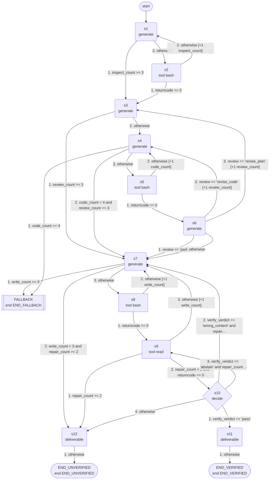

# dabench: machine guide

_skill `dabench`; format `efsm-v1`; machine version `0.1.0`; structure fingerprint `7ca686a423`; generated by hexis 0.1.0_

## Summary

- States: 3 end, 1 decide, 7 generate, 4 tool (15 in total)
- Transitions: 29; variables: 27; step limit: 60
- Terminals: `END_VERIFIED` (verified), `END_UNVERIFIED` (unverified), `END_FALLBACK` (fallback)
- Start state: `s1`; fallback state: `FALLBACK`

## Inputs

The task must provide these inputs:

| Variable | Task input | Type |
|---|---|---|
| `request` | `request` | string |
| `output_path` | `output_path` | string |
| `data_path` | `data_path` | string |
| `work_dir` | `work_dir` | string |

## Tools

| Tool | Description | Used in | Success when | Source |
|---|---|---|---|---|
| `bash` |  | `s2`, `s8`, `s5` |  | not given |
| `read` |  | `s9` |  | not given |

## Flow



## States

| State | Kind | What it does | Reads | Writes | Clause |
|---|---|---|---|---|---|
| `s1` | generate | generates: The request is a data analysis question about one data file. The command runs inside the working directory that holds that file, so open it… | `request`, `inspect_err` | `inspect_cmd` | S1 |
| `s3` | generate | generates: Design the computation. From request and data_profile write plan as plain text with these labeled parts. target: exactly which quantities t… | `request`, `data_profile`, `review_note` | `plan` | S1 |
| `s2` | tool | calls `bash` with `{"command": "cd \"${work_dir}\" && export DATA_PATH=\"${data_path}\" WORK_DIR=\"${work_dir}\"; ${inspect_cmd}"}` |  | `ok`, `returncode`, `stdout`, `stderr`, `data_profile`, `inspect_err` | S1 |
| `s7` | generate | generates: run_out is the output of the computation, shown to you here as text. Write answer_lines: only the answer lines from run_out (the lines that… | `request`, `run_out`, `edit_log` | `answer_lines` | S5 |
| `s4` | generate | generates: Implement the plan. Write compute_cmd: ONE shell command that runs python3 (for example python3 - <<'EOF' ... EOF) with pandas on the data… | `request`, `plan`, `run_out`, `run_err`, `review_note` | `compute_cmd` | S1 |
| `FALLBACK` | end | fallback: retries, then interpreted execution (see Fallback) |  |  |  |
| `s12` | generate | writes the deliverable: The answer file could not be verified after the allowed repairs. Report honestly what was written according to edit_log and file_content, s… | `output_path`, `edit_log`, `file_content`, `run_out` | `result` | S5 |
| `s8` | tool | calls `bash` with `{"command": "cat > \"${output_path}\" <<'__ANSWER__'\n${answer_lines}\n__ANSWER__"}` |  | `ok`, `returncode`, `stdout`, `stderr`, `edit_log` | S5 |
| `s5` | tool | calls `bash` with `{"command": "cd \"${work_dir}\" && export DATA_PATH=\"${data_path}\" WORK_DIR=\"${work_dir}\"; ${compute_cmd}"}` |  | `ok`, `returncode`, `stdout`, `stderr`, `run_out`, `run_err` | S1 |
| `END_UNVERIFIED` | end | ends with terminal `END_UNVERIFIED` |  |  |  |
| `s9` | tool | calls `read` with `{"filePath": "${output_path}"}` |  | `ok`, `returncode`, `stdout`, `stderr`, `file_content` | S4.1.7 |
| `s6` | generate | generates: Validate the result before reporting it. run_out is the output of the computation (the checks followed by the answer lines; run_err is norm… | `request`, `plan`, `data_profile`, `run_out`, `run_err` | `review`, `review_note` | S1 |
| `s10` | decide | decides `pass`, `wrong_content`, `abstain`: file_content is the answer file read back after writing, as returned by the read tool: the tool wraps the file in <path… | `file_content`, `run_out`, `request` | `verify_verdict` | S4.1.7 |
| `s11` | generate | writes the deliverable: Report the result: state that the answer file at output_path was written and read back, quote its content, and summarize in two sentences h… | `output_path`, `file_content`, `plan` | `result` | S5 |
| `END_VERIFIED` | end | ends with terminal `END_VERIFIED` |  |  |  |

## Transitions

After a state's action, its transitions are checked in this order and the first one that holds is taken.

- `s1`: 1. if `inspect_count >= 3` → `s3`; 2. otherwise → `s2`
- `s3`: 1. if `review_count >= 3` → `s7`; 2. otherwise → `s4`
- `s2`: 1. if `returncode == 0` → `s3`; 2. otherwise → `s1`, add 1 to `inspect_count`
- `s7`: 1. if `write_count >= 3` → `FALLBACK`; 2. if `write_count < 3 and repair_count >= 2` → `s12`; 3. otherwise → `s8`
- `s4`: 1. if `code_count >= 4` → `FALLBACK`; 2. if `code_count < 4 and review_count >= 3` → `s7`; 3. otherwise → `s5`
- `s12`: 1. otherwise → `END_UNVERIFIED`
- `s8`: 1. if `returncode == 0` → `s9`; 2. otherwise → `s7`, add 1 to `write_count`
- `s5`: 1. if `returncode == 0` → `s6`; 2. otherwise → `s4`, add 1 to `code_count`
- `s9`: 1. if `repair_count >= 2` → `s12`; 2. if `repair_count < 2 and returncode == 0` → `s10`; 3. otherwise → `s7`, add 1 to `write_count`
- `s6`: 1. if `review == 'pass'` → `s7`; 2. if `review == 'revise_code'` → `s4`, add 1 to `review_count`; 3. if `review == 'revise_plan'` → `s3`, add 1 to `review_count`; 4. otherwise → `s7`
- `s10`: 1. if `verify_verdict == 'pass'` → `s11`; 2. if `verify_verdict == 'wrong_content' and repair_count < 2` → `s7`, add 1 to `repair_count`; 3. if `verify_verdict == 'abstain' and repair_count < 2` → `s9`, add 1 to `repair_count`; 4. otherwise → `s12`
- `s11`: 1. otherwise → `END_VERIFIED`

## Terminals

| Terminal | Kind | Outputs | End states |
|---|---|---|---|
| `END_VERIFIED` | verified | `result` | `END_VERIFIED` |
| `END_UNVERIFIED` | unverified | `result` | `END_UNVERIFIED` |
| `END_FALLBACK` | fallback |  | `FALLBACK` |

## Loops and limits

- `s1` leaves for `s3` once `inspect_count >= 3`
- `s3` leaves for `s7` once `review_count >= 3`
- `s7` leaves for `FALLBACK` once `write_count >= 3`
- `s4` leaves for `FALLBACK` once `code_count >= 4`
- `s9` leaves for `s12` once `repair_count >= 2`
- A run stops after 60 steps.

## Fallback

`FALLBACK` is reached through a transition or when a state's action fails. The hexis runtime then retries from the most recently executed tool state (from the state that prepares its arguments, if there is one) and resets the counter whose limit led there; when the retries are used up, it hands the task to interpreted execution of the skill document.

States with a transition to the fallback state: `s4`, `s7`

## Running the machine

With the command-line interface (a build directory can be passed as `--machine`):

```bash
hexis-agent run --machine BUILD_DIR --input request=... --input output_path=... --input data_path=... --input work_dir=... --workdir WORK_DIR --executor local
```

From Python:

```python
from hexis.execution import runtime
from hexis.machine.schema import load_machine

machine = load_machine("machine.json")
result = runtime.run_task(machine, {"input": {"request": ..., "output_path": ..., "data_path": ..., "work_dir": ...}}, model=model, tools=tools, doc=skill_document, on_error="fallback", retries=3)
print(result.stopped, result.path())
```

With an agent: give `PROMPT.md` to a tool-using agent as its system prompt (or paste it at the start of the conversation) together with the task inputs.

## Privacy

`PROMPT.md` contains the whole machine, including prompts derived from the skill document. The hexis runtime shows a model only the prompt of the state it is executing. A build directory also contains copies of the traces and the questions sent to the model while updating the machine; review it before sharing.

