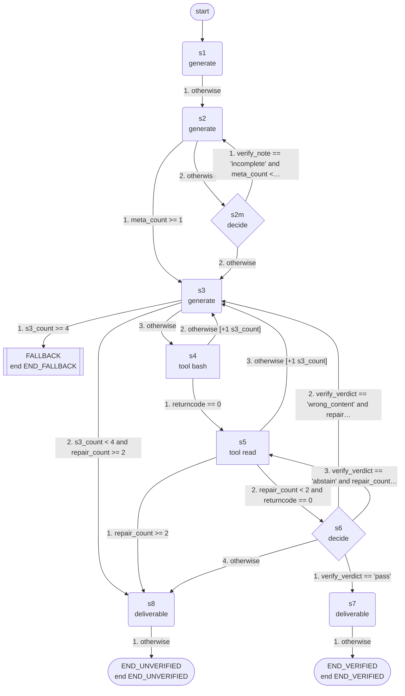

# livemath: machine guide

_skill `livemath`; format `efsm-v1`; machine version `0.1.0`; structure fingerprint `a7edeb1f8a`; generated by hexis 0.1.0_

## Summary

- States: 3 end, 2 decide, 5 generate, 2 tool (12 in total)
- Transitions: 19; variables: 18; step limit: 40
- Terminals: `END_VERIFIED` (verified), `END_UNVERIFIED` (unverified), `END_FALLBACK` (fallback)
- Start state: `s1`; fallback state: `FALLBACK`

## Inputs

The task must provide these inputs:

| Variable | Task input | Type |
|---|---|---|
| `request` | `request` | string |
| `output_path` | `output_path` | string |

## Tools

| Tool | Description | Used in | Success when | Source |
|---|---|---|---|---|
| `bash` |  | `s4` |  | not given |
| `read` |  | `s5` |  | not given |

## Flow



## States

| State | Kind | What it does | Reads | Writes | Clause |
|---|---|---|---|---|---|
| `s1` | generate | generates: Read the request: it contains a theorem-grounded mathematics question and five options labeled A to E. Write analysis as plain text with th… | `request` | `analysis` | S1 |
| `s2` | generate | generates: Decide the answer from analysis and request. Decision procedure. Step 1: never discard a META option here (it makes no clause of its own);… | `request`, `analysis`, `verify_note` | `answer_letter`, `justification` | S2 |
| `s3` | generate | generates: Write write_cmd: ONE shell command that writes exactly one line '\\boxed{X}' with X replaced by answer_letter to the file at output_path, c… | `answer_letter`, `output_path`, `edit_log` | `write_cmd` | S3 |
| `s2m` | decide | decides `complete`, `incomplete`, `abstain`: answer_letter names the option chosen from request. If that option is the META option ('one of the remaining options is… | `request`, `analysis`, `answer_letter` | `verify_note` | S2 |
| `FALLBACK` | end | fallback: retries, then interpreted execution (see Fallback) |  |  |  |
| `s8` | generate | writes the deliverable: The answer file could not be verified after the allowed repairs. Report honestly what was written according to edit_log and file_content, s… | `output_path`, `edit_log`, `file_content`, `answer_letter` | `result` | S3 |
| `s4` | tool | calls `bash` with `{"command": "${write_cmd}"}` |  | `ok`, `returncode`, `stdout`, `stderr`, `edit_log` | S3 |
| `END_UNVERIFIED` | end | ends with terminal `END_UNVERIFIED` |  |  |  |
| `s5` | tool | calls `read` with `{"filePath": "${output_path}"}` |  | `ok`, `returncode`, `stdout`, `stderr`, `file_content` | S3 |
| `s6` | decide | decides `pass`, `wrong_content`, `abstain`: file_content is the answer file read back after writing. Answer 'pass' if it contains exactly one \\boxed{X} whose lett… | `file_content`, `answer_letter` | `verify_verdict` | S3 |
| `s7` | generate | writes the deliverable: Report the result: state that the answer file at output_path was written and read back, quote its content, give answer_letter and the justi… | `output_path`, `file_content`, `answer_letter`, `justification` | `result` | S3 |
| `END_VERIFIED` | end | ends with terminal `END_VERIFIED` |  |  |  |

## Transitions

After a state's action, its transitions are checked in this order and the first one that holds is taken.

- `s1`: 1. otherwise → `s2`
- `s2`: 1. if `meta_count >= 1` → `s3`; 2. otherwise → `s2m`
- `s3`: 1. if `s3_count >= 4` → `FALLBACK`; 2. if `s3_count < 4 and repair_count >= 2` → `s8`; 3. otherwise → `s4`
- `s2m`: 1. if `verify_note == 'incomplete' and meta_count < 1` → `s2`, add 1 to `meta_count`; 2. otherwise → `s3`
- `s8`: 1. otherwise → `END_UNVERIFIED`
- `s4`: 1. if `returncode == 0` → `s5`; 2. otherwise → `s3`, add 1 to `s3_count`
- `s5`: 1. if `repair_count >= 2` → `s8`; 2. if `repair_count < 2 and returncode == 0` → `s6`; 3. otherwise → `s3`, add 1 to `s3_count`
- `s6`: 1. if `verify_verdict == 'pass'` → `s7`; 2. if `verify_verdict == 'wrong_content' and repair_count < 2` → `s3`, add 1 to `repair_count`; 3. if `verify_verdict == 'abstain' and repair_count < 2` → `s5`, add 1 to `repair_count`; 4. otherwise → `s8`
- `s7`: 1. otherwise → `END_VERIFIED`

## Terminals

| Terminal | Kind | Outputs | End states |
|---|---|---|---|
| `END_VERIFIED` | verified | `result` | `END_VERIFIED` |
| `END_UNVERIFIED` | unverified | `result` | `END_UNVERIFIED` |
| `END_FALLBACK` | fallback |  | `FALLBACK` |

## Loops and limits

- `s2` leaves for `s3` once `meta_count >= 1`
- `s3` leaves for `FALLBACK` once `s3_count >= 4`
- `s5` leaves for `s8` once `repair_count >= 2`
- A run stops after 40 steps.

## Fallback

`FALLBACK` is reached through a transition or when a state's action fails. The hexis runtime then retries from the most recently executed tool state (from the state that prepares its arguments, if there is one) and resets the counter whose limit led there; when the retries are used up, it hands the task to interpreted execution of the skill document.

States with a transition to the fallback state: `s3`

## Running the machine

With the command-line interface (a build directory can be passed as `--machine`):

```bash
hexis-agent run --machine BUILD_DIR --input request=... --input output_path=... --workdir WORK_DIR --executor local
```

From Python:

```python
from hexis.execution import runtime
from hexis.machine.schema import load_machine

machine = load_machine("machine.json")
result = runtime.run_task(machine, {"input": {"request": ..., "output_path": ...}}, model=model, tools=tools, doc=skill_document, on_error="fallback", retries=3)
print(result.stopped, result.path())
```

With an agent: give `PROMPT.md` to a tool-using agent as its system prompt (or paste it at the start of the conversation) together with the task inputs.

## Privacy

`PROMPT.md` contains the whole machine, including prompts derived from the skill document. The hexis runtime shows a model only the prompt of the state it is executing. A build directory also contains copies of the traces and the questions sent to the model while updating the machine; review it before sharing.

