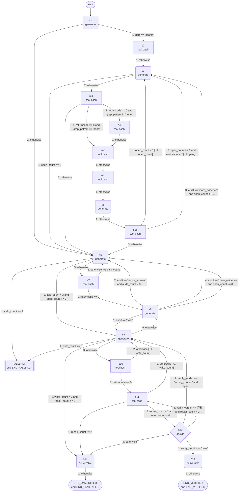

# sealqa: machine guide

_skill `sealqa`; format `efsm-v1`; machine version `0.2.0`; structure fingerprint `35ef944486`; generated by hexis 0.1.0_

## Summary

- States: 3 end, 1 decide, 8 generate, 9 tool (21 in total)
- Transitions: 39; variables: 37; step limit: 80
- Terminals: `END_VERIFIED` (verified), `END_UNVERIFIED` (unverified), `END_FALLBACK` (fallback)
- Start state: `s1`; fallback state: `FALLBACK`

## Inputs

The task must provide these inputs:

| Variable | Task input | Type |
|---|---|---|
| `request` | `request` | string |
| `output_path` | `output_path` | string |
| `docs_dir` | `docs_dir` | string |
| `work_dir` | `work_dir` | string |

## Tools

| Tool | Description | Used in | Success when | Source |
|---|---|---|---|---|
| `bash` |  | `s2`, `s7`, `s3c`, `s10`, `s4b`, `s4`, `s4c`, `s5b` |  | not given |
| `read` |  | `s11` |  | not given |

## Flow



## States

| State | Kind | What it does | Reads | Writes | Clause |
|---|---|---|---|---|---|
| `s1` | generate | generates: Classify the question before searching, and rewrite its target as a schema. The request states the question, that the evidence is the local… | `request`, `docs_dir` | `gate`, `schema` | S4 |
| `s2` | tool | calls `bash` with `{"command": "cd \"${docs_dir}\" && for f in $(ls *.txt \| sort -V); do printf '%s \| %s bytes \| ' \"$f\" \"$(wc -c < \"$f\" \| tr -d ' ')\"; head -n 3 \"$f\" \| tr '\\n' ' ' \| cut -c1-260; echo; done"}` |  | `ok`, `returncode`, `stdout`, `stderr`, `index` | S3 |
| `s6` | generate | generates: Derive the answer deterministically. open_count is the number of pages opened out of 8; at 8 no more evidence will arrive, so the answer mu… | `request`, `schema`, `evidence`, `audit_note`, `calc_err`, `open_count` | `answer_draft`, `calc_cmd` | S5 |
| `s3` | generate | generates: Open sources. index lists every local page file with its size and its TITLE / URL / DATE header; opened lists the files already opened in f… | `request`, `schema`, `index`, `evidence`, `opened`, `open_count` | `grep_pattern`, `open_file` | S3 |
| `FALLBACK` | end | fallback: retries, then interpreted execution (see Fallback) |  |  |  |
| `s9` | generate | generates: calc_out is the stdout of the calculation and answer_draft the intended answer. Write final_line: the single final answer line to be stored… | `calc_out`, `answer_draft`, `edit_log`, `read_err` | `final_line` | S4.38 |
| `s7` | tool | calls `bash` with `{"command": "SCH=$(cat <<'__S__'\n${schema}\n__S__\n); CMD=$(cat <<'__C__'\n${calc_cmd}\n__C__\n); if [ \"${calc_count}\" -lt 2 ] && printf '%s' \"$SCH\" \| grep -q -i -E 'type:[^;]*(count\|list\|threshold\|ranking\|superlative\|ordinal)' && printf '%s' \"$CMD\" \| grep -q -E '^[[:space:]]*(printf\|echo)[[:space:]]'; then echo 'REJECTED: for a count, list, threshold, ranking or ordinal question the answer must be computed from the ledger rows in the script (a python list that is filtered and counted or compared), not printed as a bare value'; exit 1; fi; bash -c \"$CMD\""}` |  | `ok`, `returncode`, `stdout`, `stderr`, `calc_out`, `calc_err` | S5 |
| `s3c` | tool | calls `bash` with `{"command": "OP=$(cat <<'__T__'\n${opened}\n__T__\n); OF=$(cat <<'__T__'\n${open_file}\n__T__\n); GO=$(cat <<'__G__'\n${grep_out}\n__G__\n); IX=$(cat <<'__I__'\n${index}\n__I__\n); OF=$(printf '%s' \"$OF\" \| tr -d '[:space:]'); is_open() { printf '%s\\n' \"$OP\" \| grep -qx -- \"$1\"; }; CH=\"\"; if [ -n \"$OF\" ] && ! is_open \"$OF\" && [ -f \"${docs_dir}/$OF\" ]; then CH=\"$OF\"; NOTE=\"ok: $OF\"; fi; if [ -z \"$CH\" ]; then for f in $(printf '%s\\n' \"$GO\" \| sed -n '/HITS PER FILE/,/MATCHING LINES/p' \| grep -E '^doc_[0-9]+\\.txt:[0-9]+$' \| sort -t: -k2 -nr \| cut -d: -f1); do if ! is_open \"$f\"; then CH=\"$f\"; NOTE=\"substituted (choice '$OF' was already opened or invalid): $f, the unopened file with most grep hits\"; break; fi; done; fi; if [ -z \"$CH\" ]; then for f in $(printf '%s\\n' \"$IX\" \| grep -oE '^doc_[0-9]+\\.txt'); do if ! is_open \"$f\"; then CH=\"$f\"; NOTE=\"substituted (choice '$OF' was already opened or invalid): $f, the first unopened file in index\"; break; fi; done; fi; if [ -z \"$CH\" ]; then exit 1; fi; printf '%s' \"$CH\""}` |  | `ok`, `returncode`, `stdout`, `stderr`, `open_file` | S3 |
| `s13` | generate | writes the deliverable: The answer file could not be verified after the allowed repairs. Report honestly what was written according to edit_log and file_content, s… | `output_path`, `edit_log`, `file_content`, `calc_out` | `result` | S4.38 |
| `s10` | tool | calls `bash` with `{"command": "cat > \"${output_path}\" <<'__ANSWER__'\n${final_line}\n__ANSWER__"}` |  | `ok`, `returncode`, `stdout`, `stderr`, `edit_log` | S4.38 |
| `s8` | generate | generates: Run the final audit before any file is written. open_count is the number of pages already opened out of 8; when it is 8 or more, no further… | `request`, `schema`, `evidence`, `answer_draft`, `calc_out`, `open_count` | `audit`, `audit_note` | S4 |
| `s4b` | tool | calls `bash` with `{"command": "OF=$(cat <<'__T__'\n${open_file}\n__T__\n); OF=$(printf '%s' \"$OF\" \| tr -d '[:space:]'); F=\"${docs_dir}/$OF\"; if [ ! -f \"$F\" ]; then echo \"NO SUCH FILE: $OF\" >&2; exit 1; fi; echo \"===== $OF ($(wc -c < \"$F\" \| tr -d ' ') bytes) =====\"; head -c 60000 \"$F\"; echo; echo \"===== END OF $OF =====\""}` |  | `ok`, `returncode`, `stdout`, `stderr`, `page_text`, `page_err` | S3 |
| `s4` | tool | calls `bash` with `{"command": "cd \"${docs_dir}\" && PAT=$(cat <<'__T__'\n${grep_pattern}\n__T__\n); echo \"=== HITS PER FILE (file:count) for pattern: $PAT ===\"; grep -c -i -E -- \"$PAT\" *.txt 2>/dev/null \| grep -v ':0$' \| sort -t: -k2 -nr \| head -30; echo \"=== MATCHING LINES (file:line:text, first 120) ===\"; grep -n -i -E -- \"$PAT\" *.txt 2>/dev/null \| cut -c1-220 \| head -120; echo \"=== END ===\""}` |  | `ok`, `returncode`, `stdout`, `stderr`, `grep_out` | S3 |
| `END_UNVERIFIED` | end | ends with terminal `END_UNVERIFIED` |  |  |  |
| `s11` | tool | calls `read` with `{"filePath": "${output_path}"}` |  | `ok`, `returncode`, `stdout`, `stderr`, `file_content`, `read_err` | S4.38 |
| `s4c` | tool | calls `bash` with `{"command": "OP=$(cat <<'__T__'\n${opened}\n__T__\n); OF=$(cat <<'__T__'\n${open_file}\n__T__\n); printf '%s\\n%s\\n' \"$OP\" \"$OF\" \| grep -v '^none$' \| awk 'NF' \| awk '!seen[$0]++'"}` |  | `ok`, `returncode`, `stdout`, `stderr`, `opened` | S3 |
| `s12` | decide | decides `pass`, `wrong_content`, `弃权`: file_content is the answer file read back after writing, as returned by the read tool: the tool wraps the file in <path… | `file_content`, `final_line`, `answer_draft` | `verify_verdict` | S4.38 |
| `s5` | generate | generates: Extract the evidence of this round. grep_out lists, across all local pages, how many lines each file matches grep_pattern and the first mat… | `request`, `schema`, `grep_out`, `page_text`, `page_err`, `evidence`, `opened`, `open_count` | `new_findings`, `next` | S4 |
| `s14` | generate | writes the deliverable: Report the result: state that the answer file at output_path was written and read back, quote its content, and summarize in two sentences w… | `output_path`, `file_content`, `evidence` | `result` | S4.38 |
| `s5b` | tool | calls `bash` with `{"command": "EV=$(cat <<'__E__'\n${evidence}\n__E__\n); NF=$(cat <<'__N__'\n${new_findings}\n__N__\n); OF=$(cat <<'__T__'\n${open_file}\n__T__\n); { if [ \"$EV\" != \"none\" ]; then printf '%s\\n' \"$EV\"; fi; printf '\\n=== page %s: %s ===\\n%s\\n' \"${open_count}\" \"$OF\" \"$NF\"; }"}` (arguments prepared by `s5`) |  | `ok`, `returncode`, `stdout`, `stderr`, `evidence` | S4 |
| `END_VERIFIED` | end | ends with terminal `END_VERIFIED` |  |  |  |

## Transitions

After a state's action, its transitions are checked in this order and the first one that holds is taken.

- `s1`: 1. if `gate == 'search'` → `s2`; 2. otherwise → `s6`
- `s2`: 1. otherwise → `s3`
- `s6`: 1. if `calc_count >= 3` → `FALLBACK`; 2. if `calc_count < 3 and audit_count >= 3` → `s9`; 3. otherwise → `s7`
- `s3`: 1. if `open_count >= 8` → `s6`; 2. otherwise → `s3c`
- `s9`: 1. if `write_count >= 3` → `FALLBACK`; 2. if `write_count < 3 and repair_count >= 2` → `s13`; 3. otherwise → `s10`
- `s7`: 1. if `returncode == 0` → `s8`; 2. otherwise → `s6`, add 1 to `calc_count`
- `s3c`: 1. if `returncode == 0 and grep_pattern == 'none'` → `s4b`; 2. if `returncode == 0 and grep_pattern != 'none'` → `s4`; 3. otherwise → `s6`
- `s13`: 1. otherwise → `END_UNVERIFIED`
- `s10`: 1. if `returncode == 0` → `s11`; 2. otherwise → `s9`, add 1 to `write_count`
- `s8`: 1. if `audit == 'pass'` → `s9`; 2. if `audit == 'revise_answer' and audit_count < 3` → `s6`, add 1 to `audit_count`; 3. if `audit == 'more_evidence' and open_count < 8` → `s3`, add 1 to `open_count`; 4. if `audit == 'more_evidence' and open_count >= 8 and audit_count < 3` → `s6`, add 1 to `audit_count`; 5. otherwise → `s9`
- `s4b`: 1. otherwise → `s4c`
- `s4`: 1. otherwise → `s4b`
- `s11`: 1. if `repair_count >= 2` → `s13`; 2. if `repair_count < 2 and returncode == 0` → `s12`; 3. otherwise → `s9`, add 1 to `write_count`
- `s4c`: 1. otherwise → `s5`
- `s12`: 1. if `verify_verdict == 'pass'` → `s14`; 2. if `verify_verdict == 'wrong_content' and repair_count < 2` → `s9`, add 1 to `repair_count`; 3. if `verify_verdict == '弃权' and repair_count < 2` → `s11`, add 1 to `repair_count`; 4. otherwise → `s13`
- `s5`: 1. otherwise → `s5b`
- `s14`: 1. otherwise → `END_VERIFIED`
- `s5b`: 1. if `open_count < 1` → `s3`, add 1 to `open_count`; 2. if `open_count >= 1 and next == 'open'` → `s3`, add 1 to `open_count`; 3. otherwise → `s6`

## Terminals

| Terminal | Kind | Outputs | End states |
|---|---|---|---|
| `END_VERIFIED` | verified | `result` | `END_VERIFIED` |
| `END_UNVERIFIED` | unverified | `result` | `END_UNVERIFIED` |
| `END_FALLBACK` | fallback |  | `FALLBACK` |

## Loops and limits

- `s6` leaves for `FALLBACK` once `calc_count >= 3`
- `s3` leaves for `s6` once `open_count >= 8`
- `s9` leaves for `FALLBACK` once `write_count >= 3`
- `s11` leaves for `s13` once `repair_count >= 2`
- A run stops after 80 steps.

## Fallback

`FALLBACK` is reached through a transition or when a state's action fails. The hexis runtime then retries from the most recently executed tool state (from the state that prepares its arguments, if there is one) and resets the counter whose limit led there; when the retries are used up, it hands the task to interpreted execution of the skill document.

States with a transition to the fallback state: `s6`, `s9`

## Running the machine

With the command-line interface (a build directory can be passed as `--machine`):

```bash
hexis-agent run --machine BUILD_DIR --input request=... --input output_path=... --input docs_dir=... --input work_dir=... --workdir WORK_DIR --executor local
```

From Python:

```python
from hexis.execution import runtime
from hexis.machine.schema import load_machine

machine = load_machine("machine.json")
result = runtime.run_task(machine, {"input": {"request": ..., "output_path": ..., "docs_dir": ..., "work_dir": ...}}, model=model, tools=tools, doc=skill_document, on_error="fallback", retries=3)
print(result.stopped, result.path())
```

With an agent: give `PROMPT.md` to a tool-using agent as its system prompt (or paste it at the start of the conversation) together with the task inputs.

## Privacy

`PROMPT.md` contains the whole machine, including prompts derived from the skill document. The hexis runtime shows a model only the prompt of the state it is executing. A build directory also contains copies of the traces and the questions sent to the model while updating the machine; review it before sharing.

