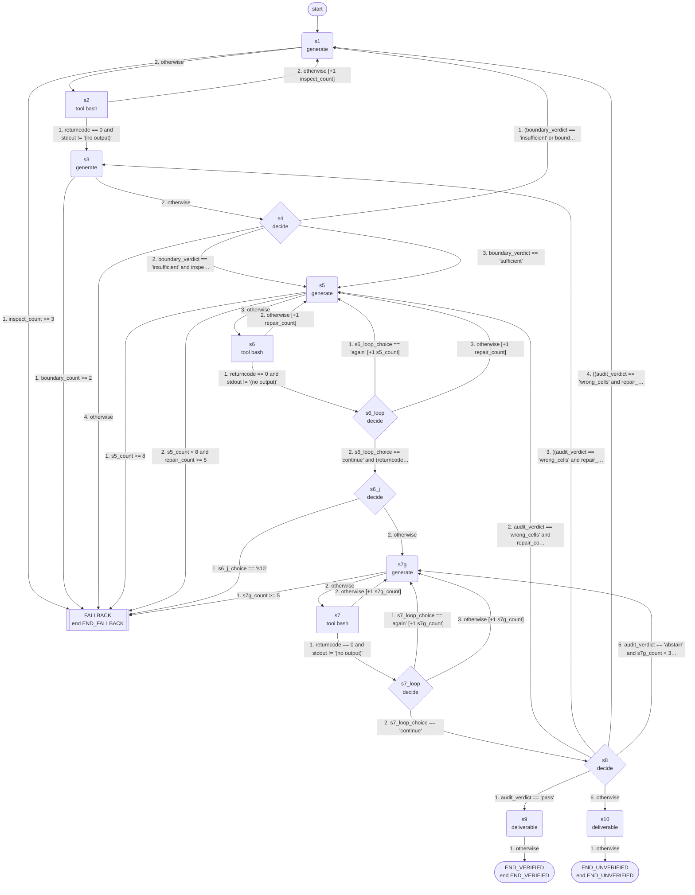

# structure-preserving-spreadsheet-edits: machine guide

_skill `structure-preserving-spreadsheet-edits`; format `efsm-v1`; machine version `0.1.0`; structure fingerprint `22436fce4f`; generated by hexis 0.1.0_

## Summary

- States: 3 end, 5 decide, 6 generate, 3 tool (17 in total)
- Transitions: 35; variables: 27; step limit: 67
- Terminals: `END_VERIFIED` (verified), `END_UNVERIFIED` (unverified), `END_FALLBACK` (fallback)
- Start state: `s1`; fallback state: `FALLBACK`

## Inputs

The task must provide these inputs:

| Variable | Task input | Type |
|---|---|---|
| `request` | `request` | string |
| `input_path` | `input_path` | string |
| `output_path` | `output_path` | string |

## Tools

| Tool | Description | Used in | Success when | Source |
|---|---|---|---|---|
| `bash` |  | `s2`, `s6`, `s7` |  | not given |

## Flow



## States

| State | Kind | What it does | Reads | Writes | Clause |
|---|---|---|---|---|---|
| `s1` | generate | generates: Inspect Before Editing. Produce inspect_cmd: ONE shell command 'python3 - <<'PY' ... PY' (openpyxl available) that reads the workbook at os… | `followup_targets`, `input_path`, `inspect_cmd`, `inspect_report`, `output_path`, `request`, `stderr` | `inspect_cmd` | S2.1.1 |
| `FALLBACK` | end | fallback: retries, then interpreted execution (see Fallback) |  |  |  |
| `s2` | tool | calls `bash` with `{"command": "INPUT_PATH=\"${input_path}\" ${inspect_cmd}"}` (arguments prepared by `s1`) |  | `ok`, `returncode`, `stdout`, `stderr`, `inspect_report` | S2.1.1 |
| `s3` | generate | generates: The request is a TASK to perform on the workbook, never a question to answer in prose: 'How can I ...' or 'I need a formula ...' means do i… | `edit_plan`, `followup_targets`, `inspect_report`, `request`, `verify_report` | `boundary_model`, `followup_targets` | S2.1.2 |
| `s4` | decide | decides `sufficient`, `insufficient`, `abstain`: Decide whether inspect_report gives enough structural evidence to commit to boundary_model. Answer 'sufficient' by defa… | `inspect_report`, `boundary_model`, `followup_targets` | `boundary_verdict` | S2.1.3 |
| `s5` | generate | generates: The request is a TASK to perform on the workbook, never a question to answer in prose: 'How can I ...' or 'I need a formula ...' means do i… | `request`, `input_path`, `output_path`, `boundary_model`, `inspect_report`, `verify_report`, `edit_log`, `stderr` | `edit_plan`, `edit_cmd` | S2.2.1 |
| `s6` | tool | calls `bash` with `{"command": "INPUT_PATH=\"${input_path}\" OUTPUT_PATH=\"${output_path}\" ${edit_cmd}"}` |  | `ok`, `returncode`, `stdout`, `stderr`, `edit_log` | S2.2.2 |
| `s6_loop` | decide | decides `again`, `continue`, `abstain`: Step s6: bash/apply {"command": "${edit_cmd}"} may need to run more than once. Given its output, answer 'again' if the… | `stdout`, `edit_log` | `s6_loop_choice` |  |
| `s6_j` | decide | decides `s7g`, `s10`, `abstain`: After s6: bash/apply {"command": "${edit_cmd}"}, decide which step comes next. Options: 's7g' = s7g: model → ['verify_c… | `stdout`, `edit_log` | `s6_j_choice` |  |
| `s7g` | generate | generates: Verify The Saved Workbook. First: if verify_cmd is not 'none', verify_report contains '=== 4.' and contains NO 'error', 'Error', 'Traceback… | `boundary_model`, `edit_plan`, `edit_log`, `verify_cmd`, `verify_report`, `stderr` | `verify_cmd` | S2.3.1 |
| `s7` | tool | calls `bash` with `{"command": "INPUT_PATH=\"${input_path}\" OUTPUT_PATH=\"${output_path}\" ${verify_cmd}"}` (arguments prepared by `s7g`) |  | `ok`, `returncode`, `stdout`, `stderr`, `verify_report` | S2.3.1 |
| `s7_loop` | decide | decides `again`, `continue`, `abstain`: The audit in s7 is a program written for this workbook: answer 'again' only if its report is empty, unreadable or missi… | `stdout`, `verify_report` | `s7_loop_choice` |  |
| `s8` | decide | decides `pass`, `wrong_cells`, `boundary_wrong`, `abstain`: Judge verify_report. Step 1 - find every line that starts with 'FLAG' in the report. If there is at least one FLAG line… | `verify_report`, `edit_plan`, `boundary_model` | `audit_verdict` | S2.3.3 |
| `s9` | generate | writes the deliverable: Report the result of the verified edit: state that the saved workbook at output_path was reopened and audited against the input, list the e… | `request`, `output_path`, `edit_plan`, `edit_log`, `verify_report` | `result` | S2.3.3 |
| `s10` | generate | writes the deliverable: The machine retreated through plan repair, boundary re-derivation and re-inspection and still could not pass the audit. Report honestly wha… | `request`, `output_path`, `boundary_model`, `verify_report` | `result` | S2.2.5 |
| `END_VERIFIED` | end | ends with terminal `END_VERIFIED` |  |  | S2.3 |
| `END_UNVERIFIED` | end | ends with terminal `END_UNVERIFIED` |  |  | S2.2.5 |

## Transitions

After a state's action, its transitions are checked in this order and the first one that holds is taken.

- `s1`: 1. if `inspect_count >= 3` → `FALLBACK`; 2. otherwise → `s2`
- `s2`: 1. if `returncode == 0 and stdout != '(no output)'` → `s3`; 2. otherwise → `s1`, add 1 to `inspect_count`
- `s3`: 1. if `boundary_count >= 2` → `FALLBACK`; 2. otherwise → `s4`
- `s4`: 1. if `(boundary_verdict == 'insufficient' or boundary_verdict == 'abstain') and inspect_count < 2` → `s1`, add 1 to `inspect_count`; 2. if `boundary_verdict == 'insufficient' and inspect_count >= 2` → `s5`; 3. if `boundary_verdict == 'sufficient'` → `s5`; 4. otherwise → `FALLBACK`
- `s5`: 1. if `s5_count >= 8` → `FALLBACK`; 2. if `s5_count < 8 and repair_count >= 5` → `FALLBACK`; 3. otherwise → `s6`
- `s6`: 1. if `returncode == 0 and stdout != '(no output)'` → `s6_loop`; 2. otherwise → `s5`, add 1 to `repair_count`
- `s6_loop`: 1. if `s6_loop_choice == 'again'` → `s5`, add 1 to `s5_count`; 2. if `s6_loop_choice == 'continue' and (returncode == 0)` → `s6_j`; 3. otherwise → `s5`, add 1 to `repair_count`
- `s6_j`: 1. if `s6_j_choice == 's10'` → `FALLBACK`; 2. otherwise → `s7g`
- `s7g`: 1. if `s7g_count >= 5` → `FALLBACK`; 2. otherwise → `s7`
- `s7`: 1. if `returncode == 0 and stdout != '(no output)'` → `s7_loop`; 2. otherwise → `s7g`, add 1 to `s7g_count`
- `s7_loop`: 1. if `s7_loop_choice == 'again'` → `s7g`, add 1 to `s7g_count`; 2. if `s7_loop_choice == 'continue'` → `s8`; 3. otherwise → `s7g`, add 1 to `s7g_count`
- `s8`: 1. if `audit_verdict == 'pass'` → `s9`; 2. if `audit_verdict == 'wrong_cells' and repair_count < 2` → `s5`, add 1 to `repair_count`; 3. if `((audit_verdict == 'wrong_cells' and repair_count >= 2) or audit_verdict == 'boundary_wrong') and boundary_count < 1` → `s3`, add 1 to `boundary_count`; 4. if `((audit_verdict == 'wrong_cells' and repair_count >= 2) or audit_verdict == 'boundary_wrong') and boundary_count >= 1 and inspect_count < 2` → `s1`, add 1 to `inspect_count`; 5. if `audit_verdict == 'abstain' and s7g_count < 3` → `s7g`, add 1 to `s7g_count`; 6. otherwise → `s10`
- `s9`: 1. otherwise → `END_VERIFIED`
- `s10`: 1. otherwise → `END_UNVERIFIED`

## Terminals

| Terminal | Kind | Outputs | End states |
|---|---|---|---|
| `END_VERIFIED` | verified | `result` | `END_VERIFIED` |
| `END_UNVERIFIED` | unverified | `result` | `END_UNVERIFIED` |
| `END_FALLBACK` | fallback |  | `FALLBACK` |

## Loops and limits

- `s1` leaves for `FALLBACK` once `inspect_count >= 3`
- `s3` leaves for `FALLBACK` once `boundary_count >= 2`
- `s5` leaves for `FALLBACK` once `s5_count >= 8`
- `s7g` leaves for `FALLBACK` once `s7g_count >= 5`
- A run stops after 67 steps.

## Fallback

`FALLBACK` is reached through a transition or when a state's action fails. The hexis runtime then retries from the most recently executed tool state (from the state that prepares its arguments, if there is one) and resets the counter whose limit led there; when the retries are used up, it hands the task to interpreted execution of the skill document.

States with a transition to the fallback state: `s1`, `s3`, `s4`, `s5`, `s6_j`, `s7g`

## Running the machine

With the command-line interface (a build directory can be passed as `--machine`):

```bash
hexis-agent run --machine BUILD_DIR --input request=... --input input_path=... --input output_path=... --workdir WORK_DIR --executor local
```

From Python:

```python
from hexis.execution import runtime
from hexis.machine.schema import load_machine

machine = load_machine("machine.json")
result = runtime.run_task(machine, {"input": {"request": ..., "input_path": ..., "output_path": ...}}, model=model, tools=tools, doc=skill_document, on_error="fallback", retries=3)
print(result.stopped, result.path())
```

With an agent: give `PROMPT.md` to a tool-using agent as its system prompt (or paste it at the start of the conversation) together with the task inputs.

## Privacy

`PROMPT.md` contains the whole machine, including prompts derived from the skill document. The hexis runtime shows a model only the prompt of the state it is executing. A build directory also contains copies of the traces and the questions sent to the model while updating the machine; review it before sharing.

